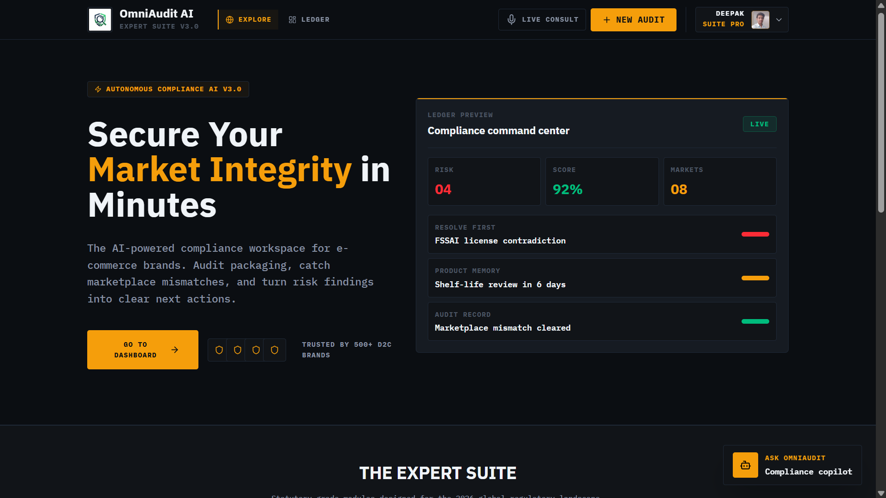
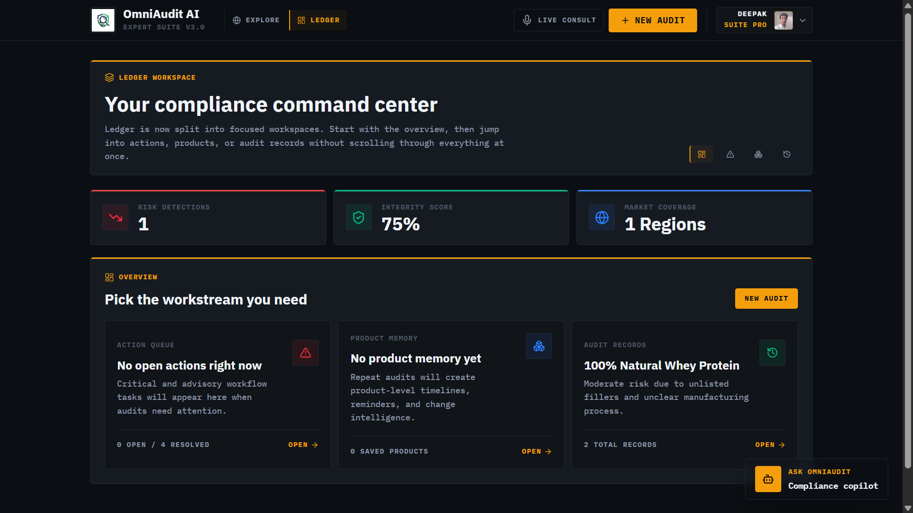
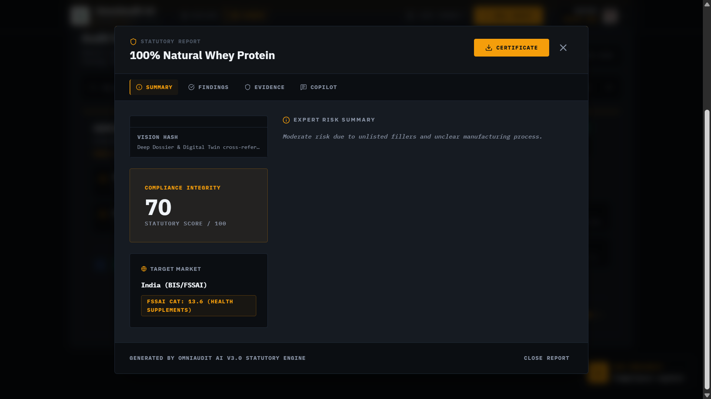
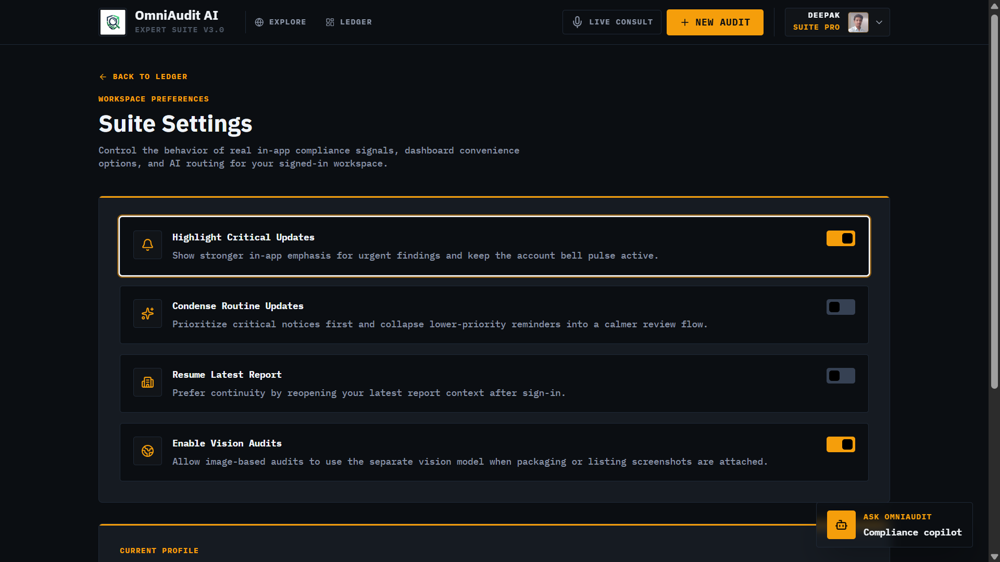

# OmniAudit AI — quick overview

OmniAudit AI is a snappy, multimodal compliance workspace for e-commerce teams — run audits on product text and images, generate structured reports, and track your audit history.



Why you'll like it:

- Fast text + image audits
- Compact dashboard with filtered audit feeds
- Downloadable report PDFs and AI-assisted rewrite suggestions

## Screenshots

A quick tour — click images to open the full versions.

<div style="display:flex;gap:18px;flex-wrap:wrap;align-items:flex-start;">
   <figure style="flex:1 1 320px;max-width:420px;margin:0;">
      <a href="./public/home-page.png"></a>
      <figcaption style="text-align:center;margin-top:6px;font-size:0.95rem;color:var(--text-dim);">Home — launchpad and quick audit</figcaption>
   </figure>

   <figure style="flex:1 1 320px;max-width:420px;margin:0;">
      <a href="./public/ledger-details.png"></a>
      <figcaption style="text-align:center;margin-top:6px;font-size:0.95rem;color:var(--text-dim);">Ledger — audit history and filters</figcaption>
   </figure>

   <figure style="flex:1 1 320px;max-width:420px;margin:0;">
      <a href="./public/report-details.png"></a>
      <figcaption style="text-align:center;margin-top:6px;font-size:0.95rem;color:var(--text-dim);">Report — findings, scores, and exports</figcaption>
   </figure>

   <figure style="flex:1 1 320px;max-width:420px;margin:0;">
      <a href="./public/settings-page.png"></a>
      <figcaption style="text-align:center;margin-top:6px;font-size:0.95rem;color:var(--text-dim);">Settings — workspace preferences and toggles</figcaption>
   </figure>
</div>

## Quick start

1. Clone and install

   ```bash
   git clone https://github.com/deepakpatil26/OmniAudit-AI.git
   cd OmniAudit-AI
   npm install
   ```

2. Copy `.env.example` → `.env` and set required keys (Firebase + GROQ)

3. Run locally

   ```bash
   npm run dev
   ```

## Helpful scripts

- `npm run dev` — dev server
- `npm run build` — production build
- `npm run preview` — preview build
- `npm run lint` — TypeScript checks
- `npm test` — run unit tests
- `npm run make:gif` — regenerate `public/demo.gif` from screenshots

## CI & tests

This repo includes a GitHub Actions workflow to run `lint` + `test` on pushes to `main`.

## Notes

- Keep `.env` secret. Rotate keys if accidentally committed.
- See [CHANGELOG.md](./CHANGELOG.md) for release notes.
- Contributions welcome! Open issues or PRs for bugs, features, or improvements.
